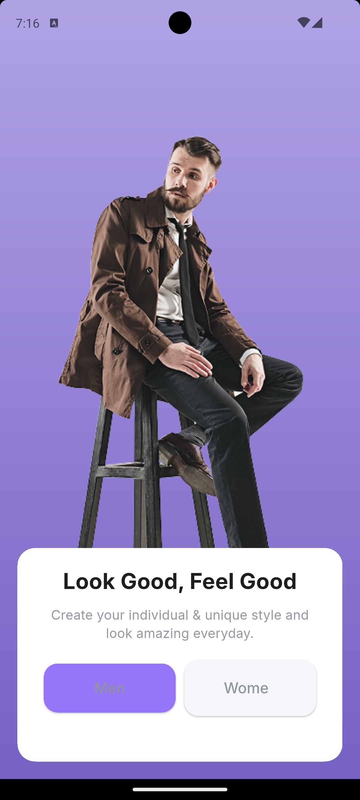

# 🛒 ECommerce App

A modern Flutter eCommerce application built with Clean Architecture, BLoC pattern, and Dependency Injection.

## 📱 About

This project demonstrates modern Flutter development practices including:
- **Clean Architecture** with feature-based organization
- **BLoC (Cubit)** for state management
- **Dependency Injection** with GetIt
- **Custom Native Splash Screen**
- **Smooth Animations & Transitions**
- **Beautiful Onboarding Flow**

## 🏗️ Architecture

```
lib/
├── core/
│   ├── constants/        # App constants and colors
│   ├── di/              # Dependency injection setup
│   ├── error/           # Error handling
│   ├── routing/         # GoRouter configuration
│   ├── services/        # Core services
│   └── usecases/        # Base use cases
├── features/
│   ├── auth/            # Authentication feature
│   ├── onboarding/      # Onboarding screens
│   ├── products/        # Product management
│   └── splash/          # Splash screen
└── shared/
    ├── widgets/         # Reusable UI components
    └── theme/           # App theming
```

## 🚀 Features

- [x] **Native Splash Screen** with custom logo and colors
- [x] **Native Splash Screen** with custom logo and colors
- [x] **Onboarding Flow** with interactive gender selection
- [x] **Clean Architecture** structure with feature-based organization
- [x] **State Management** with StatefulWidget toggles
- [x] **Bottom Navigation** with smooth slide animations
- [x] **Routing** with GoRouter and debug logging
- [x] **Gradient Backgrounds** and modern UI design
- [x] **Custom Assets** and illustrations
- [ ] **Authentication System**
- [ ] **Product Catalog**
- [ ] **Shopping Cart**
- [ ] **User Profile**

## 📸 UI Progress

###  Flow
<div >


  
</div>


**Features Shown:**
- � Purple gradient background
- 👥 Gender selection toggle (Man/Woman)
- 🖼️ Custom illustration with man-chair asset
- 🔘 Interactive toggle buttons with state management
- 📱 Modern card-based UI design

### 🎨 Splash Screen
* Custom splash with purple gradient and app logo*

### 🏠 Main Navigation  
*Coming Soon - Bottom navigation with slide transitions between tabs*

**Planned Screenshots:**
- [ ] Native splash screen
- [x] Onboarding flow with gender selection
- [ ] Home screen with navigation
- [ ] Products catalog screen
- [ ] Cart and profile screens

### 🎭 Theme & Colors
- **Primary Color**: `#9775FA` (Purple)
- **Gradient**: Top to bottom purple gradient
- **Typography**: Inter font family
- **Design**: Modern, clean, and accessible

## 🛠️ Tech Stack

- **Flutter**: 3.29.2
- **Dart**: 3.9.2
- **State Management**: flutter_bloc (8.1.6)
- **Routing**: go_router (14.2.7)
- **DI**: get_it (8.0.2)
- **HTTP Client**: dio (5.7.0)
- **Local Storage**: shared_preferences (2.3.2)
- **Splash**: flutter_native_splash (2.4.1)

## 📋 Getting Started

### Prerequisites
- Flutter SDK (3.29.2 or higher)
- Dart (3.9.2 or higher)
- Android Studio / VS Code
- Android/iOS device or emulator

### Installation

1. **Clone the repository**
   ```bash
   git clone https://github.com/ZiadAhmedH/eCommerce_app_mentor.git
   cd eCommerce_app_mentor
   ```

2. **Install dependencies**
   ```bash
   flutter pub get
   ```

3. **Generate splash screen**
   ```bash
   flutter pub run flutter_native_splash:create
   ```

4. **Run the app**
   ```bash
   flutter run
   ```

## 📁 Project Structure

The project follows **Clean Architecture** principles:

- **Domain Layer**: Business logic and entities
- **Data Layer**: Data sources and repositories
- **Presentation Layer**: UI and state management

Each feature is self-contained with its own:
- Domain (entities, repositories, use cases)
- Data (models, data sources, repository implementations)
- Presentation (pages, widgets, BLoC/Cubit)

## 🎯 Roadmap

- [ ] Complete authentication system
- [ ] Implement product catalog with categories
- [ ] Add shopping cart functionality
- [ ] Create user profile management
- [ ] Add payment integration
- [ ] Implement order tracking
- [ ] Add push notifications
- [ ] Create admin panel

## 🤝 Contributing

1. Fork the repository
2. Create your feature branch (`git checkout -b feature/amazing-feature`)
3. Commit your changes (`git commit -m 'Add amazing feature'`)
4. Push to the branch (`git push origin feature/amazing-feature`)
5. Open a Pull Request

## 📄 License

This project is licensed under the MIT License - see the [LICENSE](LICENSE) file for details.

## 📞 Contact

**Ziad Ahmed** - [@ZiadAhmedH](https://github.com/ZiadAhmedH)

Project Link: [https://github.com/ZiadAhmedH/eCommerce_app_mentor](https://github.com/ZiadAhmedH/eCommerce_app_mentor)
